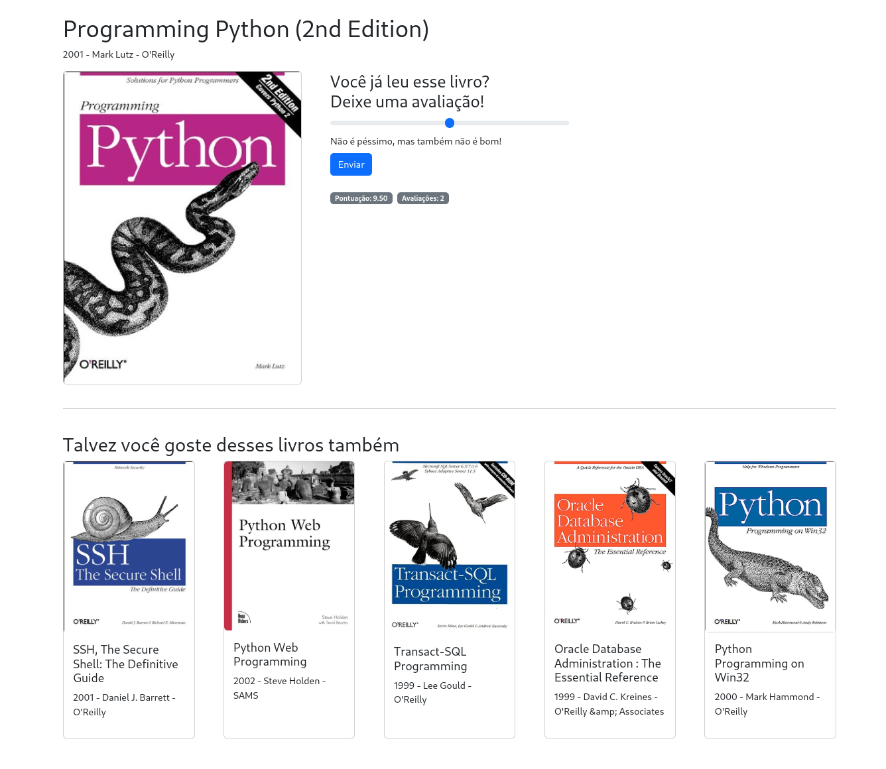

# FIAP 2MLET Fase 3
Projeto para a fase 3 do curso de Machine Learning Engineering da FIAP.

Base de dados utilizada: https://www.kaggle.com/datasets/saurabhbagchi/books-dataset/data

## Estrutura
O projeto é uma simples Loja de Livros onde os usuários podem pesquisar e avaliar os livros. Com base nas avaliações dos usuários, um modelo de ML servido por uma API produz uma lista de livros relacionados quando o usuário acessa a página de um livro qualquer. 



Os sistemas são separado nas seguintes partes:

- Uma Aplicação Web em ExpressJS
- Uma API de Recomendações em FastAPI
- Um banco de dados MySQL
- Notebooks para processar os dados e o Modelo.

## Subindo as aplicações
Com exceção dos notebooks, o restante das aplicações são iniciadas usando Docker. Para iniciar as aplicações utilize as automações feitas em Makefile.

Mas antes de subir todas as aplicações algumas configurações e setups precisam ser feitos, na seguinte ordem, e será detalhado mais abaixo:
 - Setup do ambiente
 - Download do dataset
 - Preparar o banco de dados
 - Treinar o modelo de recomendação
 - Subir os containers das aplicações

### Pré-Requisitos para rodar as aplicações
- Make
- Docker
### Pré-Requisitos para rodar os Notebooks
- Python (3.10.15)
- Virtualenv
- Installar as Libs do `requirements.txt`
- Visual Code
- Java JDK 17+ (Apenas para os notebooks com PySpark)

### Instalando o virtualenv e as libs
```sh
    make setup
```

### Baixando os datasets
Faça download do dataset que está no link https://www.kaggle.com/datasets/saurabhbagchi/books-dataset/data
e descompacte os arquivos em ./datasets/books

### Preparando o banco de dados
Suba o MySQL e carregue os dados rodando o notebook de import
```sh
    make recreate-db
    make run-import-notebook
```

### Treinando o modelo de recomendação
```sh
    make run-model-generation-notebook
```

### Subindo os containers das aplicações
```sh
    make restart-book-store
    make restart-recommendation-api
```


Abra o arquivo Makefile para ver todas as tasks que podem ser executadas, como por exemplo reiniciar apenas uma aplicação ou banco.

# Acessando as aplicações
- [WebApp - Book Store](http://localhost:3000)
- [API de Recomendação (Substitua o ISBN por um número válido)](http://localhost:8000/books/recommendation?isbn=<ISBN>&n=5) 